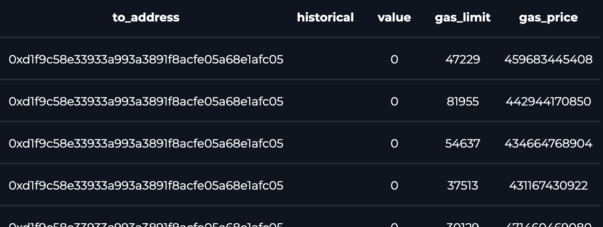
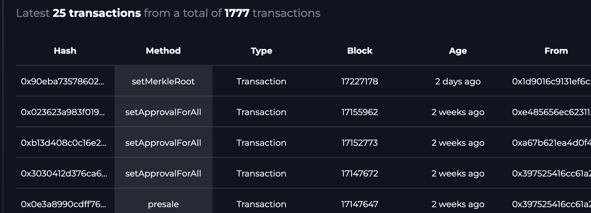

# sort.xyz react components

React components created to simplify web3 UI application development.

1. [`<SQLQuery/>`](#sqlquery)
1. [`<LatestTransactions/>`](#latesttransactions)
1. [`<PushNotifications/>`](#pushnotifications)

## Installation

```sh
npm install @sort/react-components
```

## Components

### SQLQuery

Execute a SQL query and display as a table

```jsx
import { SQLQuery } from "@sortxyz/react-components";

<SQLQuery
  query="select * from polygon.transaction where to_address='0xd1f9c58e33933a993a3891f8acfe05a68e1afc05' order by block_id desc"
  api_key="API_KEY"
  />
```



Explore the [interactive example](https://sort.xyz/contracts/matic/0xd1f9c58e33933a993a3891f8acfe05a68e1afc05/sql).

### LatestTransactions

Show your latest transactions in a table

```jsx
import { LatestTransactions } from "@sortxyz/react-components";

<LatestTransactions
   contract_address="0xd1f9c58e33933a993a3891f8acfe05a68e1afc05"
   chain="polygon"
   api_key="API_KEY"
   theme="dark"
 />
```



Explore the [interactive example](https://sort.xyz/contracts/matic/0xd1f9c58e33933a993a3891f8acfe05a68e1afc05/sql).

### PushNotifications

Visualize real-time contract events

```jsx
import { PushNotifications } from "@sortxyz/react-components";

<PushNotifications
    contract_address="0xd1f9c58e33933a993a3891f8acfe05a68e1afc05"
    contract_function=""
    num={10}
/>
```

Explore the [interactive example](https://sort.xyz/contracts/matic/0xd1f9c58e33933a993a3891f8acfe05a68e1afc05/push)
